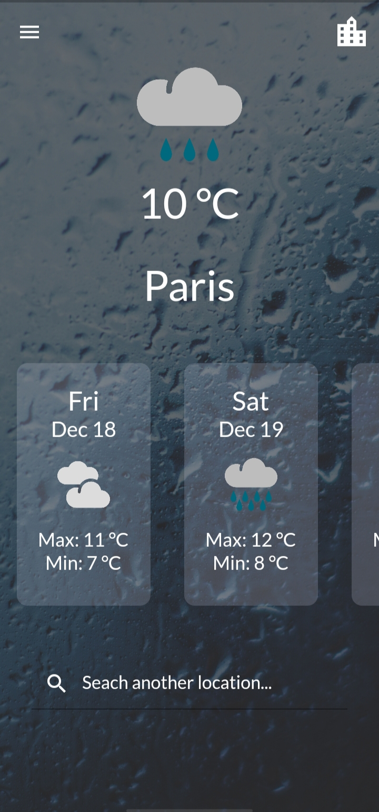
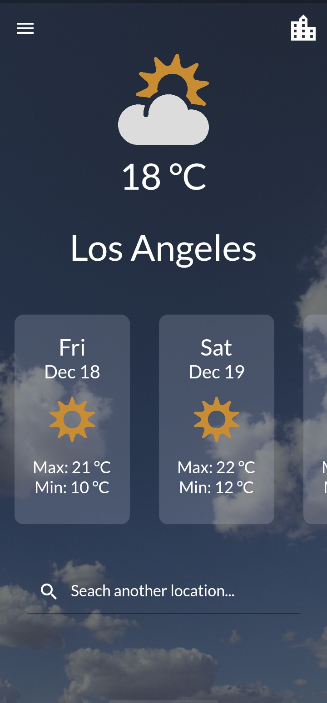
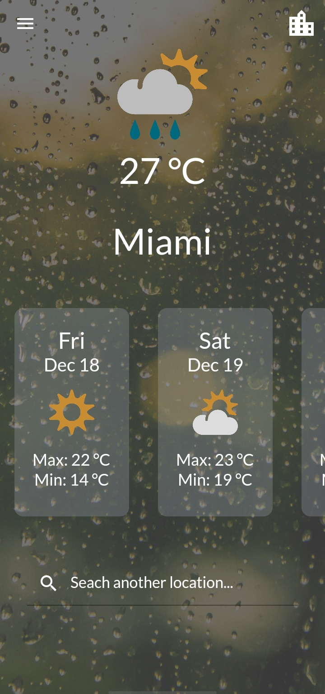
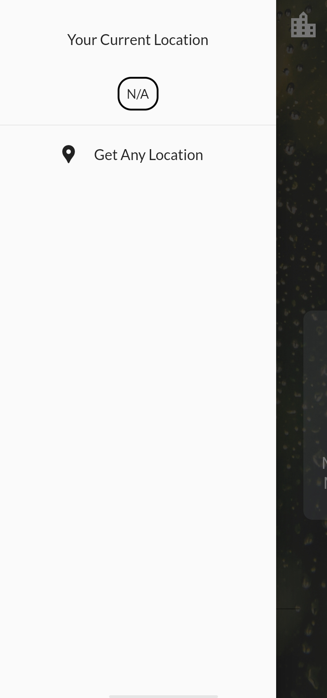
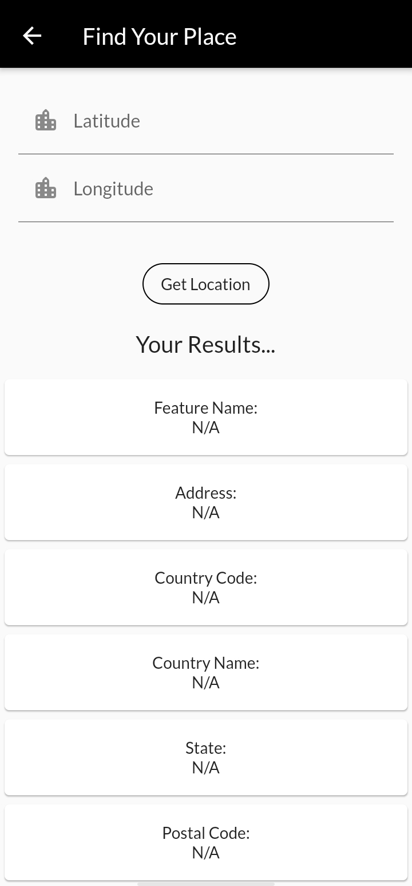
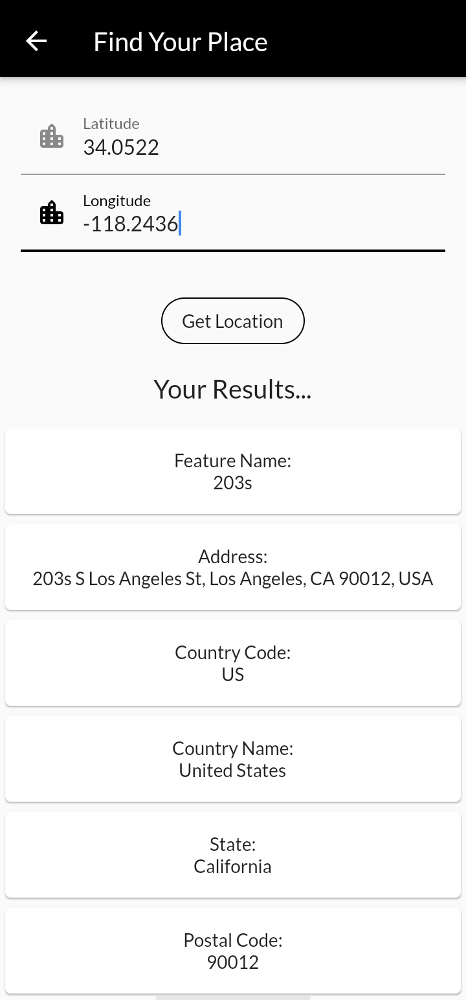

# weatherApp

A new Flutter project.

## Getting Started

Here there, So this is the weather app which i have made again in the flutter.  
Here i tried to make the UI as simple as Possible...  

## Features

Here you can basically query the weather and temperature of metro cities.  
This app will show you the weather forecast of 7 Days ahead.  
Here you can also get the current location of yourself by taping at the very top-right corner.  
Here you can find the precise information such as  
country,  
country-code,  
postal-code,  
Area, 
etc about any area, town, city, etc by just entering the coordinates of that!  
& THE AWESOME THING ABOUT THAT IT WILL GIVE YOU THE 100 PERCENT CORRECT INFORMATION :)  

                                

## What i have used:

Here i have used the weather API know as meta weather 
https://www.metaweather.com/api/  
I have used the state-management concept in this project (PROVIDER PACKAGE)  
Here i am using the main two flutter package which is:  
1. geolocator  
2. geocoder  

Thank you!
